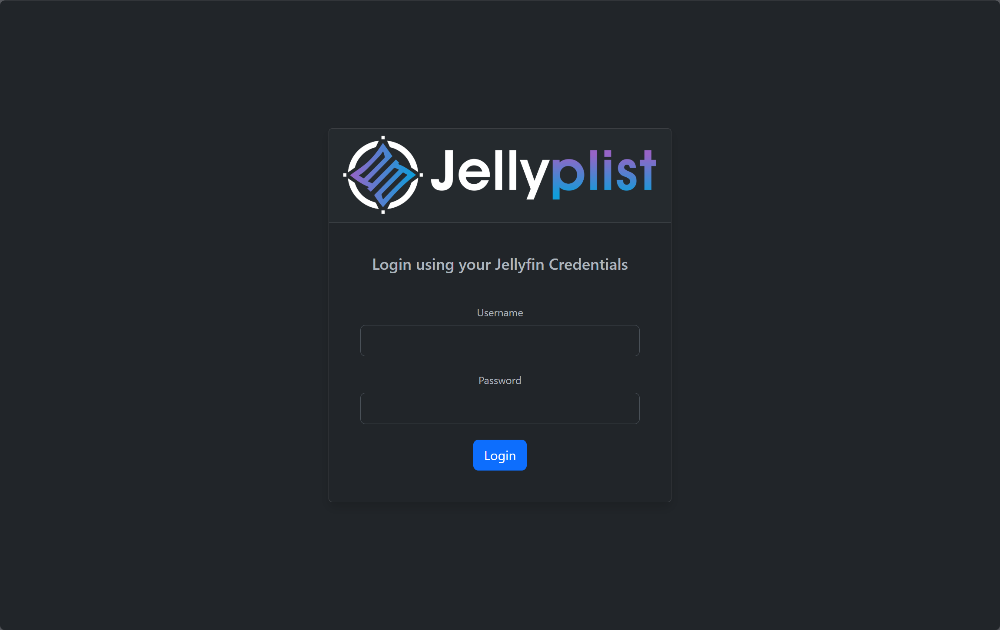
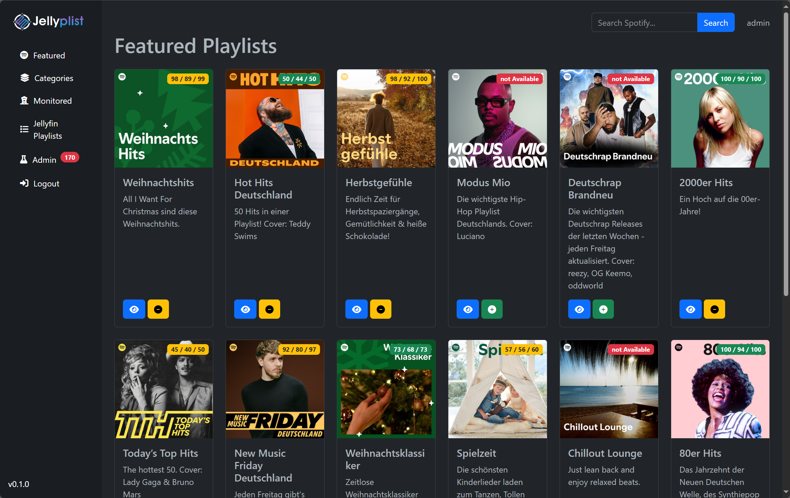
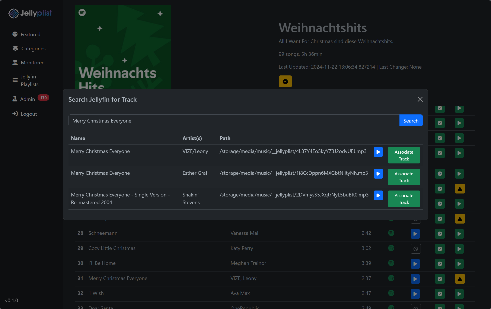
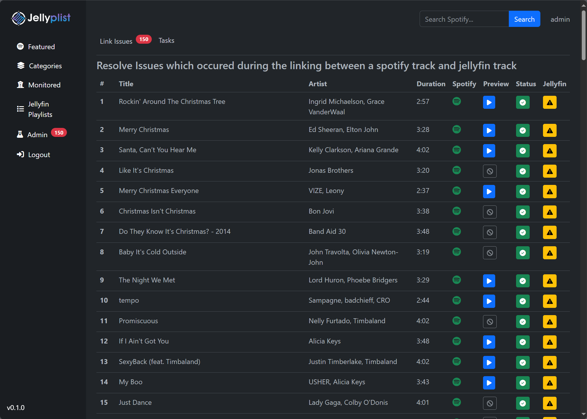

> [!WARNING]  
> Jellyplist is still at a very early stage: expect Bugs and weird behaviour 

## What is Jellyplist ? 
Jellyplist aims to be a companion app for your self-hosted [Jellyfin](https://jellyfin.org/) Server. With Jellyplist you will be able to replicate/sync playlists from Spotify to your local Jellyfin account. Under the hood, it uses [SpotDL](https://spotdl.readthedocs.io/en/latest/) for downloading the corresponding tracks from the available sources if a track isn´t found in your local library.  
## What it is not ? 
It´s definitely not a general Playlist Manager for Jellyfin.

## Features
- **Discover Playlists**: Use well-known *Featured Playlists* listings.
- **Categories**: Browse playlists by categories
- **View Monitored Playlists**: View playlists which are already synced by the server, adding these to your Jellyfin account will make them available immediately
- **Search Playlist**: Search for playlists
- **No Sign-Up or User-Accounts**: Jellyplist uses your local Jellyfin server for authentication

## Getting Started

The easiest way to start is by using docker and compose. 
1. Log in on https://developers.spotify.com/. Go to the dashboard, create an app and get your Client ID and Secret
2. Get your [cookies.txt file for spot-dl ](https://spotdl.readthedocs.io/en/latest/usage/#youtube-music-premium)
> [!IMPORTANT]  
> Currently a [youtube premium account](https://spotdl.readthedocs.io/en/latest/usage/#youtube-music-premium) is required, the next release will mitigate this.
3. Prepare a `.env` File
```
POSTGRES_USER = jellyplist
POSTGRES_PASSWORD = jellyplist
SECRET_KEY = Keykeykesykykesky  # Secret key for session management
JELLYFIN_SERVER_URL = http://192.168.178.14:8096  # local Jellyfin server
JELLYFIN_ADMIN_USER = admin # due to api limitations jellyplist uses user authentication rather than api tokens
JELLYFIN_ADMIN_PASSWORD = admin_password_for_your_jellyifn_admin
SPOTIPY_CLIENT_ID = <Client ID from Step 1>
SPOTIPY_CLIENT_SECRET = <Secret from Step 1>
JELLYPLIST_DB_HOST = postgres-jellyplist #Hostname of the db Container
JELLYPLIST_DB_USER = jellyplist
JELLYPLIST_DB_PASSWORD = jellyplist
```

4. Prepare a `docker-compose.yml`
```yaml
services:
  redis:
    image: redis:7-alpine
    container_name: redis
    volumes:
      - redis_data:/data
    networks:
      - jellyplist-network
  postgres:
    container_name: postgres-jellyplist
    image: postgres
    environment:
      POSTGRES_USER: ${POSTGRES_USER}
      POSTGRES_PASSWORD: ${POSTGRES_PASSWORD}
      PGDATA: /data/postgres
    volumes:
       - postgres:/data/postgres
    ports:
      - "5432:5432"
    networks:
      - jellyplist-network
    restart: unless-stopped
  
  jellyplist:
    container_name: jellyplist
    image: ghcr.io/kamilkosek/jellyplist:latest
    depends_on: 
      - postgres
      - redis
    ports:
      - "5055:5055"
    networks:
      - jellyplist-network
    volumes:
        # Map Your cookies.txt file to exac
      - /your/local/path/cookies.txt:/jellyplist/cookies.txt 
      - /storage/media/music:/jellyplist_downloads
    env_file:
      - .env

    # The jellyplist-worker is used to perform background tasks, such as downloads and playlist updates.
    # It is the same container, but with a different command
  jellyplist-worker:
    container_name: jellyplist-worker
    image: ghcr.io/kamilkosek/jellyplist:latest
    command: ["celery", "-A", "app.celery", "worker", "--loglevel=info"]
    volumes:
      # Map Your cookies.txt file to exac
      - /your/local/path/cookies.txt:/jellyplist/cookies.txt 
      - /storage/media/music:/jellyplist_downloads
    env_file:
      - .env
    depends_on:
      - postgres
      - redis
    networks:
      - jellyplist-network
    # jellyplist-beat is used to schedule the background tasks
  jellyplist-beat:
    container_name: jellyplist-beat
    image: ghcr.io/kamilkosek/jellyplist:latest
    command: ["celery", "-A", "app.celery", "beat", "--loglevel=info"]
    env_file:
      - .env
    depends_on:
      - postgres
      - redis
    networks:
      - jellyplist-network

networks:
  jellyplist-network:
    driver: bridge

volumes:
    postgres:
    pgadmin:
    redis_data:
```
5. Start your stack with `docker compose up -d`
6. Optionally take a look in the logs if something went wrong
7. Launch your browser `http://<container_addr>:5055` 

## Technical Details/FAQ

- _Why have I to provide a Jellyfin Admin and Password instead of a API Token ?_

Its beccause of some limitations in the Jellyfin API. The goal of Jellyplist was to always maintain only one copy of a playlist in Jellyfin and to use SharedPlaylists which are "owned" by one admin user. 

- _Why so many containers?_

Yeah, it got a little out of hand. When I started with this project, there was a single script, but the more time I invested in it the more requirements I had. 
- _I already own a large music library, do I have to download every track ?_ 

No. Jellyplist at first tries to match the track from a Spotify playlist with a track from your local Jellyfin server. For this it uses the search feature from Jellyfin: If there are multiple search results and a preview is available from Spotify, Jellyplist tries to find the best match using [chromaprint](https://github.com/acoustid/chromaprint) and a sliding fingerprint similarity function. 

> [!CAUTION]
> The Jellyfin API esp. the search API has some serious problems with apostrophes and other special characters, resulting in no search results at all. In such cases you have to do the link between a Spotify Track ID and your Jellyfin Track ID manually through the UI. 


## Usage

#### Login using your Jellyfin Account: 



#### After Login you will be redirected to the featured playlist page:


 - Click on the green button with the plus sign , to add this playlist to your jellyfin account. The provided admin account will be the owner of the list and the list will be shared with your currently logged in user. 
 - Notice the Badge on the playlist cover: It indicates the current state `Tracks Available/Tracks Linked/Tracks Total` , if there are some unlinked tracks, you can try to link them manually. To do this, log out and log in with a Jellyfin admin account, click on the button with the `eye` icon to view the playlist details. Look for the tracks which are not linked (indicated by a yellow button), click this button and try to find the correct track and link them.
 


- When logged in as admin, you will see the admin section in the sidebar. From there you can some kind of `batch linking`. All unlinked tracks will be displayed at once. 
> [!TIP]
> Linking of tracks had to be done only once. If a different playlist has the same track, Jellyplist will reuse the link
 

